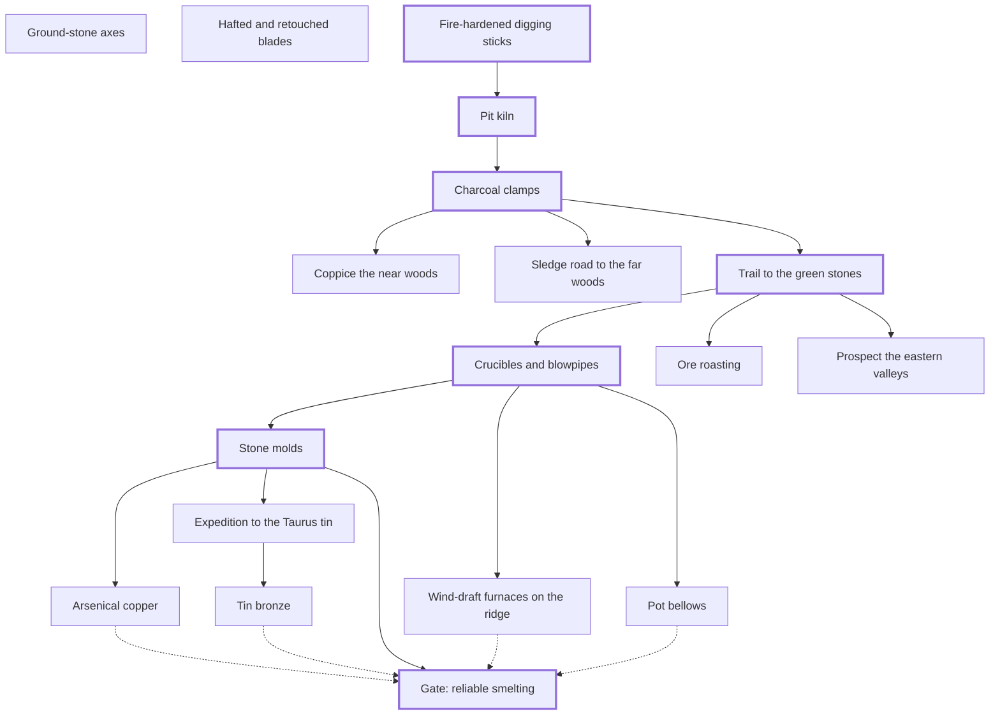
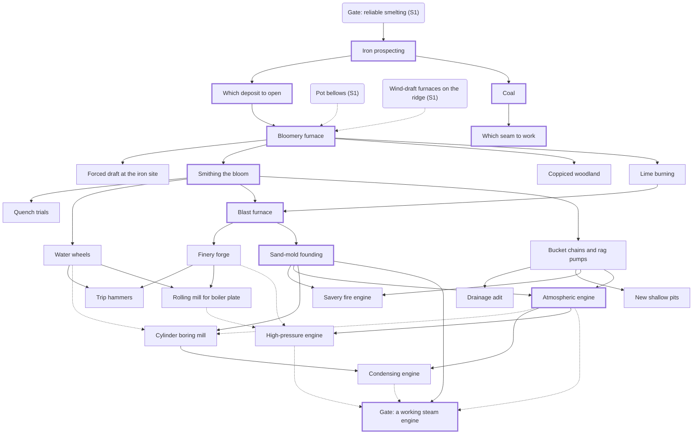
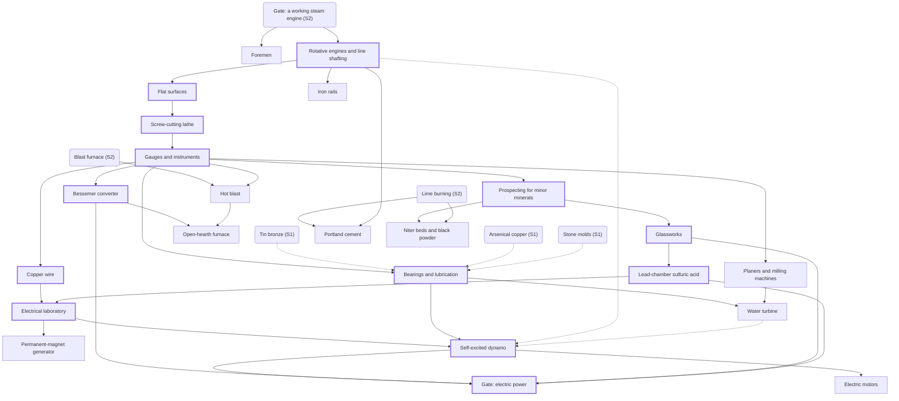
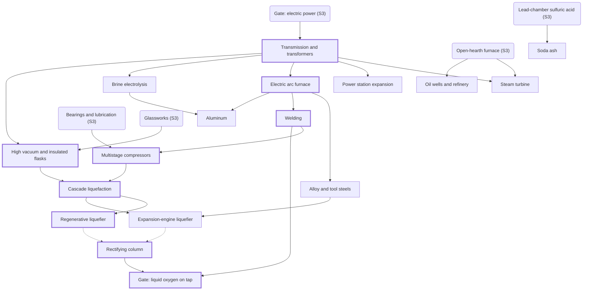
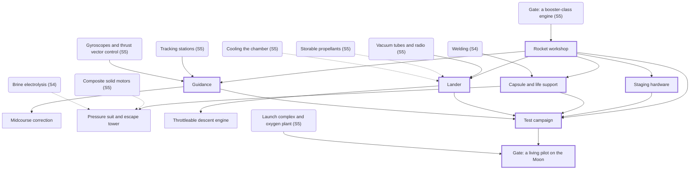

<!-- Generated by tools/validate_tree.py. Do not edit by hand. -->

# Stage structure and dependency graphs

## Stage 1: Fire and stone

Heartbeat: `tool_wear`. Gate: Reliable smelting.

| Pressure | Red when | Answers |
| --- | --- | --- |
| Tools | tool_wear < 1 | ground_stone_axes, hafted_blades, stone_molds, tin_bronze, arsenical_copper |
| Nearest wood | forest_cover < 70 (stage 1 scale) | coppice_near_woods, timber_sledges |
| Green stone left | malachite_left_kg < 20000 | ore_roasting, eastern_outcrop |

**Furnace workshop** (opens with `crucibles_blowpipes`): Air supply (from `crucibles_blowpipes`); Charcoal per kg ore (from `crucibles_blowpipes`)

| Beat | Node | Kind | Substantive | Problem |
| --- | --- | --- | --- | --- |
| 1 | `digging_sticks` | project |  | The river terraces are full of clay, but it sits under a meter of gravel that bare hands can't move. |
| 1 | `ground_stone_axes` | decision_option | yes | Flint flakes chip and snag on hardwood; felling one oak takes a crew all day. |
| 1 | `hafted_blades` | decision_option | yes | Loose flakes cut hands and snap, and a dull one is thrown away. |
| 2 | `pit_kiln` | project |  | Clay pots dry and crack, and one rain turns them back to mud. |
| 3 | `charcoal_clamps` | project |  | Copper melts at 1,085 C, and an open wood fire rarely gets past 900 C. |
| 3 | `coppice_near_woods` | decision_option | yes | The stands nearest camp are cut out, and crews walk farther every week. |
| 3 | `timber_sledges` | decision_option | yes | The stands nearest camp are cut out, and crews walk farther every week. |
| 4 | `trail_green_stones` | project |  | Your survey pages mark a malachite outcrop three days' walk east, and there is no path through the scrub. |
| 5 | `crucibles_blowpipes` | workshop | yes | You have ore and charcoal, but nothing survives the heat and no fire burns hot enough without forced air. |
| 5 | `eastern_outcrop` | decision_option | yes | The green crust is running out; below it the ore is dark and brassy, and it won't smelt. |
| 5 | `ore_roasting` | decision_option | yes | The green crust is running out; below it the ore is dark and brassy, and it won't smelt. |
| 6 | `pot_bellows` | decision_option | yes | Blowpipes can't move enough air for a bigger furnace, and breath is mostly carbon dioxide. |
| 6 | `stone_molds` | project | yes | Flint is sharp but brittle, and crews go through blades faster than knappers can make them. |
| 6 | `wind_furnaces` | decision_option | yes | Blowpipe crews are exhausted, and each crucible yields only a little copper. |
| 8 | `arsenical_copper` | decision_option | yes | Copper tools dull and bend within weeks, and toolmakers can't keep up. |
| 8 | `gate_reliable_smelting` | gate |  | Metal tools are made faster than they wear out, and the colony burns fuel for real work at scale. |
| 8 | `tin_bronze` | decision_option | yes | Pure copper casts poorly, full of bubbles, and wears fast. |
| 8 | `tin_survey_kestel` | project | yes | Bronze needs tin, which is rare; the nearest known source is in the Taurus mountains, weeks away. |

## Stage 2: Iron

Heartbeat: `fuel_balance`. Gate: A working steam engine.

| Pressure | Red when | Answers |
| --- | --- | --- |
| Fuel | daily fuel use exceeds daily fuel production for more than 10 days | charcoal_clamps, coppicing, coal_mining, watt_engine |
| Forest within two days' walk | forest_cover < 30 | coppicing, coal_mining |
| Water in the mine | mine_water_m > 0 (workings below the water table) | mine_drainage_manual, drainage_adit, shallow_pits, savery_pump, newcomen_engine, watt_engine, high_pressure_engine |
| Tools | tools < tool users | bloom_smithing, quench_temper |
| Iron quality | iron_quality < 2 (of 3) | deposit_choice, coal_seam_choice, furnace_workshop |

**furnace_workshop** (extends): Ore (from `deposit_choice`); Charge (from `bloomery`); Stack height (m) (from `blast_furnace`); Blast (from `blast_furnace`); Fuel (from `coal_seam_choice`); Lime per ton of ore (from `lime_burning`)

**Engine workshop** (opens with `savery_pump`): Lift height (m) (from `savery_pump`); Cylinder diameter (m) (from `newcomen_engine`); Boiler pressure (atm) (from `newcomen_engine`); Plate thickness (mm) and type (from `newcomen_engine`); Separate condenser (from `watt_engine`)

| Beat | Node | Kind | Substantive | Problem |
| --- | --- | --- | --- | --- |
| 1 | `deposit_choice` | decision_option | yes | Two deposits: bog iron a day's walk away, lean and phosphorus-rich, or hillside ore three days away, rich and clean, that needs a road. |
| 1 | `iron_prospecting` | project |  | Iron ore is everywhere, but your crews can't tell rich ore from red rock. |
| 2 | `bloomery` | workshop | yes | Iron doesn't melt until 1,538 C, far beyond what your copper furnaces reach. |
| 2 | `forced_draft_for_iron` | decision_option | yes | Your Stage 1 blast works only where it was built. The iron ore is somewhere else. |
| 3 | `bloom_smithing` | project | yes | The bloom is a spongy lump full of slag that crumbles if you try to use it. |
| 3 | `quench_temper` | project | yes | Wrought-iron edges are soft; iron tools bend and need constant resharpening. |
| 4 | `coal_mining` | project |  | The forest can't feed both the charcoal kilns and the furnaces. |
| 4 | `coal_seam_choice` | decision_option | yes | A seam at the surface a day away, sulfurous, or a deeper, cleaner seam three days off. |
| 4 | `coppicing` | project | yes | Charcoal crews walk a day or more to standing forest, and the woods are retreating. |
| 5 | `blast_furnace` | workshop | yes | A bloomery makes 30 kg a day and wastes most of the iron in slag. You need tons. |
| 5 | `finery_forge` | project | yes | Cast iron shatters under a hammer; you need tough wrought iron for tools, chains and plate. |
| 5 | `lime_burning` | project |  | Slag carries away too much iron, and furnace walls crumble after a few campaigns. |
| 5 | `sand_casting` | project |  | Stone and clay molds are too small and slow for pipes, cylinders and gears. |
| 5 | `trip_hammer` | upgrade |  | Hammering bars takes more smiths than you have, and the fined iron piles up unworked. |
| 5 | `water_wheels` | project | yes | Working the bellows is the most exhausting job in the colony, and it caps how big a furnace can be. |
| 6 | `drainage_adit` | project | yes | Pumpers are a tenth of the colony and the water still gains in the wet season. |
| 6 | `mine_drainage_manual` | project | yes | The galleries have gone below the water table, and they're flooding faster than buckets can bail. |
| 6 | `shallow_pits` | decision_option | yes | Rather than fight the water, you could abandon the deep workings and dig fresh pits. |
| 7 | `boring_mill` | project | yes | Cast cylinders come out oval and tapered, so a tight piston jams in one place and leaks steam in another. |
| 7 | `high_pressure_engine` | workshop | yes | Beam engines are huge; you want power small enough to move. |
| 7 | `newcomen_engine` | workshop | yes | Steam can make a vacuum; a piston in a cylinder can turn that vacuum into a pumping stroke, at any depth. |
| 7 | `plate_rolling` | project | yes | Hammered plate has thin spots, and the workshop's safety margin says so. |
| 7 | `savery_pump` | workshop | yes | Pumpers can't keep up; steam might do it without pistons at all. |
| 7 | `watt_engine` | workshop | yes | The atmospheric engine spends most of its coal reheating the cylinder every stroke. |
| 8 | `gate_steam` | gate |  | An engine, not people, keeps a mine dry. |

## Stage 3: Steam and steel

Heartbeat: `shop_hours`. Gate: Electric power from a generator.

| Pressure | Red when | Answers |
| --- | --- | --- |
| Machine shop | queue exceeds a year of shop time | machine_shop, planer_milling, electric_motors_preview |
| Parts that don't fit | a queued part needs a tolerance tighter than tolerance_mm | machine_shop, bearings_lubrication |
| Hauling | haul_workers > 2000 | rails_wagonways |
| Iron and steel quality | iron_quality < 2 | furnace_workshop, mineral_prospecting |

**furnace_workshop** (extends): Blast temperature (C) (from `hot_blast`); Converter lining (from `bessemer_converter`); Blow time (min) (from `bessemer_converter`); Manganese addition (from `bessemer_converter`)

**engine_workshop** (extends): Rotative output (from `rotative_engine_shafting`); Generator (from `dynamo`)

**Machine shop** (opens with `surface_plates`): Reference surface (from `surface_plates`); Lead screw (from `screw_cutting_lathe`); Measurement (from `measurement`); Bearings and lubrication (from `bearings_lubrication`); Shop power (from `electric_motors_preview`)

| Beat | Node | Kind | Substantive | Problem |
| --- | --- | --- | --- | --- |
| 1 | `foremen` | project | yes | Forty jobs, and half your day is moving people between them. |
| 1 | `rotative_engine_shafting` | project |  | Engines only pump up and down, but lathes, hammers and bellows need to turn. |
| 2 | `bearings_lubrication` | project | yes | Shafts running in wooden blocks with tallow heat up, wear oval, and seize at speed. |
| 2 | `measurement` | project | yes | Workshops disagree on what a millimeter is, and the furnace crew judges heat by color. |
| 2 | `planer_milling` | upgrade |  | Flat faces on big castings are still chiseled and filed by hand, weeks per engine. |
| 2 | `screw_cutting_lathe` | project |  | Hand-filed screws are all different, so every nut must be matched to its bolt. |
| 2 | `surface_plates` | workshop | yes | Nobody can make or check a truly flat surface, so every machine slide is a little crooked and parts don't fit. |
| 3 | `rails_wagonways` | project | yes | Carting coal and ore on dirt tracks takes more workers than mining it. |
| 4 | `bessemer_converter` | workshop | yes | Fined iron comes a few hundred kilograms at a time, and real steel is still a luxury. |
| 4 | `hot_blast` | upgrade |  | Blast furnaces burn tons of fuel per ton of iron, and the coal pits can't keep up. |
| 4 | `open_hearth` | upgrade |  | A Bessemer blow is over in minutes, too fast to test and correct the steel. |
| 5 | `glassworks` | project |  | Chemists can't see their reactions or hold acids; clay and metal vessels crack, react or hide what's inside. |
| 5 | `mineral_prospecting` | project |  | The converter wants dolomite and manganese, the glassmakers want sand and soda, and nobody has looked for any of it. |
| 5 | `niter_beds` | project |  | Hard rock in the deep galleries stops the picks, and fire-setting fills the mine with smoke. |
| 5 | `portland_cement` | project |  | Lime mortar sets slowly and stays weak, and heavy engines and furnaces crack their foundations. |
| 5 | `sulfuric_acid` | project |  | Nearly every chemical process you want needs a strong acid, and you have none. |
| 6 | `electrical_laboratory` | project |  | Static sparks are useless for work; the engineers need a steady current to test anything. |
| 6 | `wire_drawing` | project |  | Your chemists have seen sparks and magnets move, but there's no way to make long thin conductors. |
| 7 | `dynamo` | workshop | yes | Batteries and magnetos give watts; your works needs tens of kilowatts. |
| 7 | `electric_motors_preview` | upgrade |  | Line shafting wastes a third of the engine in belts, and every machine stops when one belt breaks. |
| 7 | `magneto_generator` | decision_option |  | You want current without batteries, using the strongest magnets you have. |
| 7 | `water_turbine` | project | yes | Water wheels turn slowly, but a generator wants to spin hundreds of times a minute. |
| 8 | `gate_generator` | gate |  | A generator delivers sustained power to the works. |

## Stage 4: Electricity and chemistry

Heartbeat: `power_balance`. Gate: Liquid oxygen on tap.

| Pressure | Red when | Answers |
| --- | --- | --- |
| Power | load exceeds generation | distribution_grid, steam_turbine, water_turbine, power_station_expansion |
| Chemicals | demand exceeds supply for 30 days | soda_ash, chlor_alkali, sulfuric_acid |
| Fuel | fuel use exceeds production | coal_mining, hot_blast, steam_turbine, water_turbine |

**engine_workshop** (extends): Transmission (from `distribution_grid`); Prime mover (from `steam_turbine`)

**Liquefier workshop** (opens with `cascade_liquefier`): Method (from `cascade_liquefier`); Compressor pressure (atm) (from `compressors`); Heat exchanger (from `linde_liquefier`); Rectifying column trays (from `air_separation`)

| Beat | Node | Kind | Substantive | Problem |
| --- | --- | --- | --- | --- |
| 1 | `distribution_grid` | workshop | yes | Every workshop needs its own engine and dynamo, because current can't travel far from the machine that makes it. |
| 1 | `power_station_expansion` | project |  | Every new load you switch on browns out the last one. |
| 1 | `steam_turbine` | upgrade | yes | Piston engines shake and wear at generator speeds, and the power station is out of room. |
| 2 | `alloy_steels` | decision_option | yes | Cutting tools soften at red heat, and turbine parts creep and crack when hot. |
| 2 | `arc_furnace` | project |  | Some metals and compounds need temperatures no fuel flame reaches. |
| 2 | `welding` | project |  | Riveted seams leak under pressure and add weight; thin tanks and pipes need continuous joints. |
| 3 | `chlor_alkali` | project |  | You need caustic soda, chlorine and hydrogen, and chemistry alone makes them slowly and dirtily. |
| 3 | `soda_ash` | decision_option | yes | Glass and chemistry need alkali by the ton, and burning plants for potash eats forest. |
| 4 | `compressors` | project |  | You can't hold gas at a hundred atmospheres; single-stage pumps overheat and leak. |
| 4 | `vacuum_and_dewar` | project |  | Anything colder than ice boils away in minutes in an ordinary container, and no pump gets the air out of glass. |
| 5 | `air_separation` | project | yes | Liquid air is four-fifths nitrogen, and a rocket burning it would lose most of its punch. |
| 5 | `cascade_liquefier` | workshop | yes | Air won't liquefy until about -190 C, and nothing you have gets close. |
| 5 | `claude_expander` | decision_option | yes | Throttling through a valve wastes most of the cooling that compressed air could give. |
| 5 | `linde_liquefier` | decision_option | yes | Throttling compressed air cools it only slightly. Unless the cold is kept and reused, it never adds up. |
| 6 | `aluminum` | project | yes | A preview of the rocket workshop shows a steel vehicle about two and a half times the mass of an aluminum one. |
| 7 | `oil` | project | yes | Your chemists want a liquid fuel that doesn't need farmland, and the survey marks oil seeps to the southeast. |
| 8 | `gate_liquid_oxygen` | gate |  | The colony makes liquid oxygen in bulk, every day. |

## Stage 5: Precision and propulsion

Heartbeat: `stand_time`. Gate: A booster-class engine fires.

| Pressure | Red when | Answers |
| --- | --- | --- |
| Test stand | queue exceeds a year | test_stand, instrumentation |
| Liquid oxygen | stock < next test's need | lox_plant_scaleup |
| Power | load exceeds generation | power_station_expansion |

**Rocket engine workshop** (opens with `first_liquid_rocket`): Oxidizer : fuel (from `first_liquid_rocket`); Chamber pressure (bar) (from `first_liquid_rocket`); Cooling (from `regenerative_cooling`); Injector (from `injector_design`); Feed system (from `pressure_fed_booster_engine`); Nozzle expansion (from `instrumentation`)

| Beat | Node | Kind | Substantive | Problem |
| --- | --- | --- | --- | --- |
| 1 | `departments` | project | yes | Twelve works and an oxygen plant, and you're still setting furnace targets by hand while the engine program waits. |
| 1 | `precision_grinding` | project |  | Shafts at thousands of rpm seize in plain bearings, and cutting tools can't finish hardened steel. |
| 2 | `electronics_lab` | project |  | Once a rocket leaves the ground, you won't know what it's doing or why it failed. |
| 2 | `instrumentation` | project | yes | Engines on test will blow up in a fraction of a second, and nobody will see what happened first. |
| 3 | `gyroscopes` | project |  | A rocket climbing through wind tips over within seconds unless something senses which way is up and pushes back. |
| 4 | `first_liquid_rocket` | workshop | yes | Nobody on your team has ever lit an engine that burns liquid oxygen. |
| 4 | `fuel_alcohol` | project | yes | Engines need tons of fuel, and without oil the only liquid fuel you can make in bulk is alcohol. |
| 4 | `test_stand` | project |  | You have to fire engines somewhere they can explode without killing anyone, while measuring every second. |
| 5 | `injector_design` | project | yes | Fuel and oxygen pour in as streams, burn unevenly, and the pressure trace shows the chamber ringing like a bell. |
| 5 | `regenerative_cooling` | project | yes | Chamber walls melt within seconds; the flame is hotter than any metal. |
| 6 | `gas_generator_turbopump` | decision_option | yes | Carrying a third propellant just to drive the pump costs mass and a whole chemical plant. |
| 6 | `hydrogen_peroxide` | decision_option | yes | Pushing propellant with tank pressure means booster tanks as thick as boilers. |
| 6 | `pressure_fed_booster_engine` | decision_option | yes | Turbopumps look like years of machining; the pressure-fed engine already works on the stand. |
| 7 | `human_computers` | project |  | Every trajectory, nozzle and orbit needs thousands of hours of arithmetic, and the engineers are doing it themselves. |
| 7 | `hypergolic_propellants` | project | yes | Liquid oxygen boils away within days, and a lander must restart its engine after coasting to the Moon. |
| 7 | `launch_complex` | project |  | A fueled rocket weighs hundreds of tons, needs tons of liquid oxygen in its last hours, and would destroy the test stand when it lights. |
| 7 | `lox_plant_scaleup` | project |  | Every static fire burns tons of liquid oxygen, and a launch will need hundreds. |
| 7 | `nitrogen_fixation` | decision_option | yes | Niter beds make a trickle; nitric acid by the ton needs nitrogen pulled from the air. |
| 7 | `solid_motors` | project |  | You need small, reliable thrusters for separating stages and settling propellant. |
| 7 | `tracking_network` | project |  | After the engines stop, nobody knows where the vehicle is or whether it's on course. |
| 8 | `gate_engine` | gate |  | An engine big enough for a first stage runs for a full minute on the stand, and there's a pad to fly it from. |

```mermaid
flowchart TD
  departments["Departments"]
  gate_liquid_oxygen --> departments
  precision_grinding["Precision grinding and ball bearings"]
  gate_liquid_oxygen --> precision_grinding
  alloy_steels --> precision_grinding
  electronics_lab["Vacuum tubes and radio"]
  vacuum_and_dewar --> electronics_lab
  instrumentation["Instrumentation and telemetry"]
  electronics_lab --> instrumentation
  measurement --> instrumentation
  gyroscopes["Gyroscopes and thrust vector control"]
  precision_grinding --> gyroscopes
  test_stand["Engine test stand"]
  portland_cement --> test_stand
  welding --> test_stand
  first_liquid_rocket["First liquid-fueled engine"]
  test_stand --> first_liquid_rocket
  oil -.-> first_liquid_rocket
  fuel_alcohol -.-> first_liquid_rocket
  fuel_alcohol["Fuel alcohol"]
  glassworks --> fuel_alcohol
  regenerative_cooling["Cooling the chamber"]
  first_liquid_rocket --> regenerative_cooling
  injector_design["Injectors"]
  regenerative_cooling --> injector_design
  precision_grinding --> injector_design
  pressure_fed_booster_engine["Pressure-fed booster"]
  injector_design --> pressure_fed_booster_engine
  hydrogen_peroxide["Peroxide-steam turbopump"]
  pressure_fed_booster_engine --> hydrogen_peroxide
  chlor_alkali --> hydrogen_peroxide
  steam_turbine --> hydrogen_peroxide
  gas_generator_turbopump["Gas-generator turbopump"]
  pressure_fed_booster_engine --> gas_generator_turbopump
  steam_turbine --> gas_generator_turbopump
  hypergolic_propellants["Storable propellants"]
  sulfuric_acid --> hypergolic_propellants
  coal_seam_choice --> hypergolic_propellants
  niter_beds -.-> hypergolic_propellants
  nitrogen_fixation -.-> hypergolic_propellants
  nitrogen_fixation["Fixed nitrogen at scale"]
  compressors --> nitrogen_fixation
  chlor_alkali --> nitrogen_fixation
  solid_motors["Composite solid motors"]
  chlor_alkali --> solid_motors
  aluminum -.-> solid_motors
  niter_beds -.-> solid_motors
  launch_complex["Launch complex and oxygen plant"]
  test_stand --> launch_complex
  air_separation --> launch_complex
  lox_plant_scaleup["Oxygen plant expansion"]
  launch_complex --> lox_plant_scaleup
  tracking_network["Tracking stations"]
  electronics_lab --> tracking_network
  human_computers["Computing office"]
  instrumentation --> human_computers
  gate_engine["Gate: a booster-class engine"]
  injector_design --> gate_engine
  gyroscopes --> gate_engine
  instrumentation --> gate_engine
  launch_complex --> gate_engine
  tracking_network --> gate_engine
  pressure_fed_booster_engine -.-> gate_engine
  hydrogen_peroxide -.-> gate_engine
  gas_generator_turbopump -.-> gate_engine
  air_separation("Rectifying column (S4)")
  alloy_steels("Alloy and tool steels (S4)")
  aluminum("Aluminum (S4)")
  chlor_alkali("Brine electrolysis (S4)")
  coal_seam_choice("Which seam to work (S2)")
  compressors("Multistage compressors (S4)")
  gate_liquid_oxygen("Gate: liquid oxygen on tap (S4)")
  glassworks("Glassworks (S3)")
  measurement("Gauges and instruments (S3)")
  niter_beds("Niter beds and black powder (S3)")
  oil("Oil wells and refinery (S4)")
  portland_cement("Portland cement (S3)")
  steam_turbine("Steam turbine (S4)")
  sulfuric_acid("Lead-chamber sulfuric acid (S3)")
  vacuum_and_dewar("High vacuum and insulated flasks (S4)")
  welding("Welding (S4)")
  classDef crit stroke-width:3px
  class precision_grinding,electronics_lab,instrumentation,gyroscopes,test_stand,first_liquid_rocket,regenerative_cooling,injector_design,pressure_fed_booster_engine,launch_complex,tracking_network,gate_engine crit
```

## Stage 6: The rocket

Heartbeat: `calendar`. Gate: A living pilot on the Moon.

| Pressure | Red when | Answers |
| --- | --- | --- |
| Years | never; it is the score | test_campaign |
| Delta-v margin | dv_margin_km_s < 0.3 | rocket_workshop, midcourse_correction |
| Known flaws | any known flaw is unfixed at launch | test_campaign |

**Rocket workshop** (opens with `rocket_workshop`): Stages (from `rocket_workshop`); Propellant per stage (t) (from `rocket_workshop`); Propellants (from `rocket_workshop`); Tanks (from `rocket_workshop`); Feed per stage (from `rocket_workshop`); Route (from `guidance_choice`)

**Test campaign** (opens with `test_campaign`): Test (from `test_campaign`); Launch crewed mission (from `test_campaign`)

| Beat | Node | Kind | Substantive | Problem |
| --- | --- | --- | --- | --- |
| 1 | `rocket_workshop` | workshop | yes | Engines and tanks exist, but nobody has worked out how big each stage must be to reach the Moon. |
| 1 | `stage_separation` | project |  | A spent stage must let go cleanly, in thin air, at high speed, without hitting the stage above. |
| 2 | `guidance_choice` | decision_option | yes | Your gyroscopes drift, and beyond the horizon the ground can't see the rocket. |
| 2 | `midcourse_correction` | upgrade |  | A small error at cutoff grows into thousands of kilometers by the Moon. |
| 3 | `capsule` | project | yes | Above about 18 km the fluids in a body boil at body temperature; the pilot needs a sealed vessel of air, and it fills with carbon dioxide within hours. |
| 3 | `crew_safety` | upgrade | yes | If the capsule leaks, or the booster fails climbing out, the pilot dies with it. |
| 4 | `lander_stage` | project | yes | The Moon has no air to slow you down; every meter per second of arrival speed must be cancelled by an engine, and the pilot can't judge height over a gray featureless surface. |
| 4 | `lander_throttle` | upgrade |  | An engine that only runs at full thrust overshoots to zero speed high above the ground or slams into it. |
| 5 | `test_campaign` | workshop | yes | Every design hides flaws you can't see on paper. |
| 7 | `gate_landing` | gate |  | One person, one way, alive on the lunar surface. |

