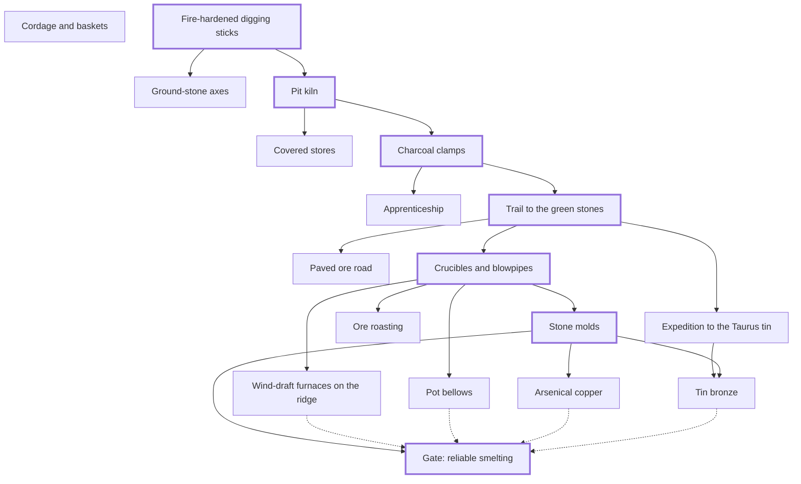
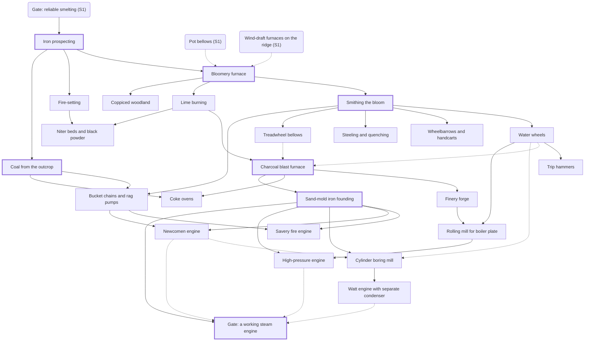
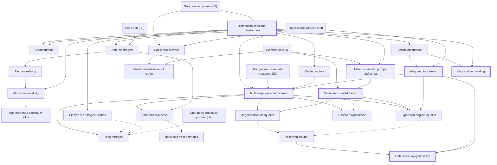

<!-- Generated by tools/validate_tree.py. Do not edit by hand. -->

# Dependency graphs

Solid arrows are required prerequisites. Dotted arrows are alternatives (any one group satisfies `any_of`). Thick borders mark the critical path; nodes from earlier stages appear as rounded boxes.

## Stage 1: Fire and stone

Critical path: Fire-hardened digging sticks → Pit kiln → Charcoal clamps → Trail to the green stones → Crucibles and blowpipes → Stone molds → Gate: reliable smelting

## Stage 2: Iron

Critical path: Iron prospecting → Bloomery furnace → Smithing the bloom → Charcoal blast furnace → Coal from the outcrop → Sand-mold iron founding → Gate: a working steam engine

## Stage 3: Steam and steel

```mermaid
flowchart TD
  rotative_engine_shafting["Rotative engines and line shafting"]
  gate_steam --> rotative_engine_shafting
  surface_plates["Three-plate surface plates"]
  gate_steam --> surface_plates
  screw_cutting_lathe["Screw-cutting lathe"]
  surface_plates --> screw_cutting_lathe
  rotative_engine_shafting --> screw_cutting_lathe
  measurement_standards["Gauges and standard measures"]
  screw_cutting_lathe --> measurement_standards
  planer_milling["Planers and milling machines"]
  measurement_standards --> planer_milling
  hot_blast["Hot blast"]
  gate_steam --> hot_blast
  coking --> hot_blast
  puddling["Puddling furnace"]
  gate_steam --> puddling
  coking --> puddling
  rails_wagonways["Iron rails"]
  rotative_engine_shafting --> rails_wagonways
  puddling -.-> rails_wagonways
  finery_forge -.-> rails_wagonways
  locomotive["Locomotives"]
  rails_wagonways --> locomotive
  high_pressure_engine -.-> locomotive
  plate_rolling -.-> locomotive
  glassworks["Glassworks"]
  gate_steam --> glassworks
  mineral_prospecting --> glassworks
  mineral_prospecting["Prospecting for minor minerals"]
  gate_steam --> mineral_prospecting
  portland_cement["Portland cement"]
  lime_burning --> portland_cement
  coal_mining --> portland_cement
  rotative_engine_shafting --> portland_cement
  sulfuric_acid["Lead-chamber sulfuric acid"]
  glassworks --> sulfuric_acid
  mineral_prospecting --> sulfuric_acid
  soda_ash["Soda ash"]
  sulfuric_acid --> soda_ash
  coal_gas_tar["Coke-oven by-products"]
  coking --> coal_gas_tar
  glassworks --> coal_gas_tar
  bessemer_converter["Bessemer converter"]
  blast_furnace_charcoal --> bessemer_converter
  measurement_standards --> bessemer_converter
  manganese_additions["Manganese additions"]
  bessemer_converter --> manganese_additions
  mineral_prospecting --> manganese_additions
  basic_lining["Basic converter lining"]
  bessemer_converter --> basic_lining
  lime_burning --> basic_lining
  mineral_prospecting --> basic_lining
  open_hearth["Open-hearth furnace"]
  bessemer_converter --> open_hearth
  hot_blast --> open_hearth
  wire_drawing["Copper wire drawing"]
  measurement_standards --> wire_drawing
  wire_insulation["Wire insulation"]
  wire_drawing --> wire_insulation
  voltaic_cells["Batteries"]
  sulfuric_acid --> voltaic_cells
  wire_drawing --> voltaic_cells
  electromagnets["Electromagnets and the motor effect"]
  voltaic_cells --> electromagnets
  wire_insulation --> electromagnets
  water_turbine["Water turbine"]
  planer_milling --> water_turbine
  magneto_generator["Permanent-magnet generator"]
  electromagnets --> magneto_generator
  rotative_engine_shafting --> magneto_generator
  bessemer_converter --> magneto_generator
  dynamo["Self-excited dynamo"]
  electromagnets --> dynamo
  planer_milling --> dynamo
  rotative_engine_shafting -.-> dynamo
  water_turbine -.-> dynamo
  gate_generator["Gate: electric power"]
  dynamo --> gate_generator
  bessemer_converter --> gate_generator
  glassworks --> gate_generator
  blast_furnace_charcoal("Charcoal blast furnace (S2)")
  coal_mining("Coal from the outcrop (S2)")
  coking("Coke ovens (S2)")
  finery_forge("Finery forge (S2)")
  gate_steam("Gate: a working steam engine (S2)")
  high_pressure_engine("High-pressure engine (S2)")
  lime_burning("Lime burning (S2)")
  plate_rolling("Rolling mill for boiler plate (S2)")
  classDef crit stroke-width:3px
  class rotative_engine_shafting,surface_plates,screw_cutting_lathe,measurement_standards,glassworks,mineral_prospecting,portland_cement,sulfuric_acid,bessemer_converter,wire_drawing,wire_insulation,voltaic_cells,electromagnets,dynamo,gate_generator crit
```

Critical path: Rotative engines and line shafting → Three-plate surface plates → Screw-cutting lathe → Gauges and standard measures → Glassworks → Prospecting for minor minerals → Portland cement → Lead-chamber sulfuric acid → Bessemer converter → Copper wire drawing → Wire insulation → Batteries → Electromagnets and the motor effect → Self-excited dynamo → Gate: electric power

## Stage 4: Electricity and chemistry

Critical path: Distribution lines and transformers → Electric arc furnace → Alloy and tool steels → Multistage gas compressors → Vacuum-insulated flasks → Mercury vacuum pumps and lamps → Gas and arc welding → Regenerative air liquefier → Rectifying column → Gate: liquid oxygen on tap

## Stage 5: Precision and propulsion

```mermaid
flowchart TD
  black_powder_rockets["Black-powder rockets"]
  gate_liquid_oxygen --> black_powder_rockets
  niter_beds --> black_powder_rockets
  precision_grinding["Precision grinding and ball bearings"]
  gate_liquid_oxygen --> precision_grinding
  alloy_steels --> precision_grinding
  electric_motors --> precision_grinding
  vacuum_tubes["Vacuum tubes"]
  vacuum_pumps --> vacuum_tubes
  glassworks --> vacuum_tubes
  radio["Radio transmitters and receivers"]
  vacuum_tubes --> radio
  instrumentation["Pressure gauges, strain gauges and telemetry"]
  radio --> instrumentation
  human_computers["Computing office"]
  gate_liquid_oxygen --> human_computers
  gyroscopes["Gyroscopes"]
  precision_grinding --> gyroscopes
  electric_motors --> gyroscopes
  test_stand["Engine test stand"]
  gate_liquid_oxygen --> test_stand
  welding --> test_stand
  portland_cement --> test_stand
  small_liquid_rocket["First liquid-fueled rocket"]
  test_stand --> small_liquid_rocket
  oil_refining -.-> small_liquid_rocket
  fuel_alcohol -.-> small_liquid_rocket
  fuel_alcohol["Fuel alcohol"]
  gate_liquid_oxygen --> fuel_alcohol
  glassworks --> fuel_alcohol
  injector_design["Impinging injectors"]
  small_liquid_rocket --> injector_design
  precision_grinding --> injector_design
  regenerative_cooling["Regenerative cooling"]
  small_liquid_rocket --> regenerative_cooling
  welding --> regenerative_cooling
  hydrogen_peroxide["Concentrated hydrogen peroxide"]
  chlor_alkali --> hydrogen_peroxide
  sulfuric_acid --> hydrogen_peroxide
  hall_heroult --> hydrogen_peroxide
  steam_turbopump["Peroxide-steam turbopump"]
  hydrogen_peroxide --> steam_turbopump
  precision_grinding --> steam_turbopump
  steam_turbine --> steam_turbopump
  gas_generator_turbopump["Gas-generator turbopump"]
  precision_grinding --> gas_generator_turbopump
  steam_turbine --> gas_generator_turbopump
  injector_design --> gas_generator_turbopump
  alloy_steels --> gas_generator_turbopump
  pressure_fed_booster_engine["Pressure-fed booster engine"]
  regenerative_cooling --> pressure_fed_booster_engine
  injector_design --> pressure_fed_booster_engine
  thrust_vector_control["Jet vanes and gimbals"]
  gyroscopes --> thrust_vector_control
  regenerative_cooling --> thrust_vector_control
  weld_radiography["X-ray weld inspection"]
  vacuum_tubes --> weld_radiography
  welding --> weld_radiography
  wind_tunnel["Supersonic wind tunnel"]
  compressors --> wind_tunnel
  instrumentation --> wind_tunnel
  sounding_rocket["Guided test rocket"]
  thrust_vector_control --> sounding_rocket
  instrumentation --> sounding_rocket
  regenerative_cooling --> sounding_rocket
  hypergolic_propellants["Storable hypergolic propellants"]
  ostwald_nitric --> hypergolic_propellants
  coal_gas_tar --> hypergolic_propellants
  solid_motors["Composite solid motors"]
  chlor_alkali --> solid_motors
  hall_heroult --> solid_motors
  gate_engine["Gate: a booster-class engine"]
  regenerative_cooling --> gate_engine
  injector_design --> gate_engine
  test_stand --> gate_engine
  gyroscopes --> gate_engine
  instrumentation --> gate_engine
  steam_turbopump -.-> gate_engine
  gas_generator_turbopump -.-> gate_engine
  pressure_fed_booster_engine -.-> gate_engine
  alloy_steels("Alloy and tool steels (S4)")
  chlor_alkali("Brine electrolysis (S4)")
  coal_gas_tar("Coke-oven by-products (S3)")
  compressors("Multistage gas compressors (S4)")
  electric_motors("Electric motors (S4)")
  gate_liquid_oxygen("Gate: liquid oxygen on tap (S4)")
  glassworks("Glassworks (S3)")
  hall_heroult("Aluminum smelting (S4)")
  niter_beds("Niter beds and black powder (S2)")
  oil_refining("Fractional distillation of crude (S4)")
  ostwald_nitric("Nitric acid from ammonia (S4)")
  portland_cement("Portland cement (S3)")
  steam_turbine("Steam turbine (S4)")
  sulfuric_acid("Lead-chamber sulfuric acid (S3)")
  vacuum_pumps("Mercury vacuum pumps and lamps (S4)")
  welding("Gas and arc welding (S4)")
  classDef crit stroke-width:3px
  class precision_grinding,vacuum_tubes,radio,instrumentation,gyroscopes,test_stand,small_liquid_rocket,injector_design,regenerative_cooling,thrust_vector_control,gate_engine crit
```

Critical path: Precision grinding and ball bearings → Vacuum tubes → Radio transmitters and receivers → Pressure gauges, strain gauges and telemetry → Gyroscopes → Engine test stand → First liquid-fueled rocket → Impinging injectors → Regenerative cooling → Jet vanes and gimbals → Gate: a booster-class engine

## Stage 6: The rocket

```mermaid
flowchart TD
  rocket_workshop["Rocket workshop"]
  gate_engine --> rocket_workshop
  single_stage_attempt["Single-stage vehicle"]
  rocket_workshop --> single_stage_attempt
  stage_separation["Stage separation"]
  rocket_workshop --> stage_separation
  solid_motors -.-> stage_separation
  niter_beds -.-> stage_separation
  launch_complex["Launch complex"]
  rocket_workshop --> launch_complex
  air_separation --> launch_complex
  lox_plant_scaleup["Oxygen plant expansion"]
  air_separation --> lox_plant_scaleup
  launch_complex --> lox_plant_scaleup
  radio_command_guidance["Radio command guidance"]
  radio --> radio_command_guidance
  tracking_network --> radio_command_guidance
  inertial_guidance["Inertial guidance platform"]
  gyroscopes --> inertial_guidance
  precision_grinding --> inertial_guidance
  vacuum_tubes --> inertial_guidance
  tracking_network["Tracking stations"]
  radio --> tracking_network
  rocket_workshop --> tracking_network
  uncrewed_orbital_flight["Uncrewed orbital flight"]
  stage_separation --> uncrewed_orbital_flight
  launch_complex --> uncrewed_orbital_flight
  tracking_network --> uncrewed_orbital_flight
  radio_command_guidance -.-> uncrewed_orbital_flight
  inertial_guidance -.-> uncrewed_orbital_flight
  lunar_impactor["Lunar impactor probe"]
  stage_separation --> lunar_impactor
  launch_complex --> lunar_impactor
  tracking_network --> lunar_impactor
  radio_command_guidance -.-> lunar_impactor
  inertial_guidance -.-> lunar_impactor
  midcourse_correction["Midcourse correction"]
  tracking_network --> midcourse_correction
  hypergolic_propellants --> midcourse_correction
  capsule["Pressure capsule"]
  rocket_workshop --> capsule
  welding --> capsule
  duralumin -.-> capsule
  open_hearth -.-> capsule
  life_support["Oxygen and CO2 scrubbing"]
  capsule --> life_support
  chlor_alkali --> life_support
  pressure_suit["Pressure suit"]
  capsule --> pressure_suit
  launch_escape["Launch escape system"]
  capsule --> launch_escape
  solid_motors --> launch_escape
  lander_stage["Lander stage"]
  rocket_workshop --> lander_stage
  hypergolic_propellants -.-> lander_stage
  regenerative_cooling -.-> lander_stage
  lander_throttle["Throttleable descent engine"]
  lander_stage --> lander_throttle
  radar_altimeter["Radar altimeter"]
  radio --> radar_altimeter
  vacuum_tubes --> radar_altimeter
  landing_gear["Landing legs and shock absorbers"]
  lander_stage --> landing_gear
  uncrewed_lunar_landing["Uncrewed lunar landing"]
  lander_stage --> uncrewed_lunar_landing
  radar_altimeter --> uncrewed_lunar_landing
  tracking_network --> uncrewed_lunar_landing
  launch_complex --> uncrewed_lunar_landing
  test_campaign["Test campaign"]
  rocket_workshop --> test_campaign
  test_stand --> test_campaign
  gate_landing["Gate: a living pilot on the Moon"]
  capsule --> gate_landing
  life_support --> gate_landing
  lander_stage --> gate_landing
  radar_altimeter --> gate_landing
  launch_complex --> gate_landing
  lox_plant_scaleup --> gate_landing
  tracking_network --> gate_landing
  stage_separation --> gate_landing
  thrust_vector_control --> gate_landing
  test_campaign --> gate_landing
  radio_command_guidance -.-> gate_landing
  inertial_guidance -.-> gate_landing
  air_separation("Rectifying column (S4)")
  chlor_alkali("Brine electrolysis (S4)")
  duralumin("Age-hardened aluminum alloy (S4)")
  gate_engine("Gate: a booster-class engine (S5)")
  gyroscopes("Gyroscopes (S5)")
  hypergolic_propellants("Storable hypergolic propellants (S5)")
  niter_beds("Niter beds and black powder (S2)")
  open_hearth("Open-hearth furnace (S3)")
  precision_grinding("Precision grinding and ball bearings (S5)")
  radio("Radio transmitters and receivers (S5)")
  regenerative_cooling("Regenerative cooling (S5)")
  solid_motors("Composite solid motors (S5)")
  test_stand("Engine test stand (S5)")
  thrust_vector_control("Jet vanes and gimbals (S5)")
  vacuum_tubes("Vacuum tubes (S5)")
  welding("Gas and arc welding (S4)")
  classDef crit stroke-width:3px
  class rocket_workshop,stage_separation,launch_complex,lox_plant_scaleup,tracking_network,capsule,life_support,lander_stage,radar_altimeter,test_campaign,gate_landing crit
```

Critical path: Rocket workshop → Stage separation → Launch complex → Oxygen plant expansion → Tracking stations → Pressure capsule → Oxygen and CO2 scrubbing → Lander stage → Radar altimeter → Test campaign → Gate: a living pilot on the Moon

